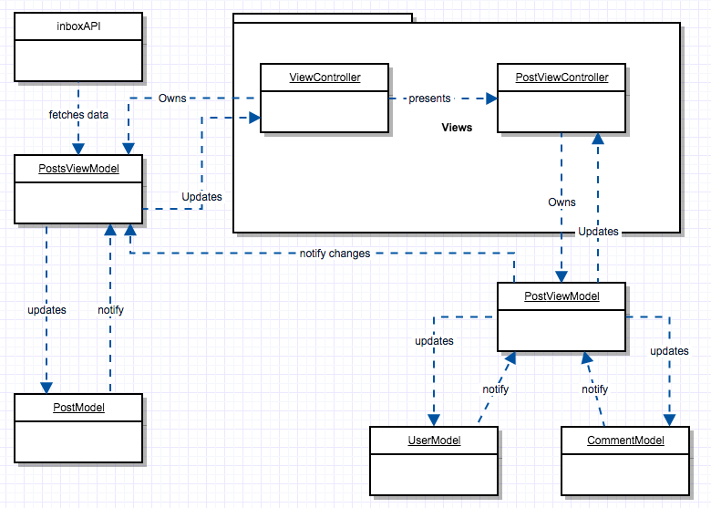

# Inbox
App that retrieves a lists of posts with its details

before running the app, go to root and execute
```sh
pod install
```
then open Inbox.xcworkspace

## Third party libraries
-  Moya: Network abstraction layer that encapsulates network requests.
-  RxSwift: Generic abstraction of computation expressed through Observable<Element> interface.
-  RxCocoa: Exposes a generic abstraction from RxSwift to Cocoa.
-  RealmSwift: Database manager
-  Then: Simple library that helps with swift initializers

# Application architecture
For this solution MVVM was implemented.



# Screenshots


